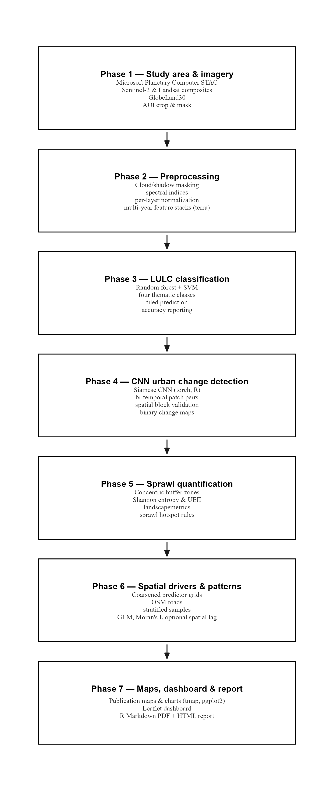

# Multi-Temporal Urban Sprawl Detection and Growth Pattern Analysis (R)

End-to-end geospatial pipeline: Phase 1 uses **Microsoft Planetary Computer** (**rstac**, signed COGs, **terra**); GlobeLand30 for reference; later phases use Random Forest + SVM, CNN (**torch**), **landscapemetrics**, **tmap** / **leaflet**. **rgee** is optional.

## Methodology flowchart

The figure below matches the seven-phase workflow used in this project (see also `docs/methodology-flowchart.png`).

## Complete detailed methodology (Phases 1–7)

### Phase 1 — Study area & dataset preparation (Planetary Computer)

| Element | Detail |
|--------|--------|
| **STAC** | `https://planetarycomputer.microsoft.com/api/stac/v1` — search via **rstac**; sign assets with the PC SAS endpoint; stream COGs with GDAL `/vsicurl/` + **terra** (no full-tile download). |
| **Sentinel-2 L2A** | Collection `sentinel-2-l2a`; years **2018, 2020, 2022, 2024** (configurable); Jan–Mar window; lowest **eo:cloud_cover** scene; bands B02, B03, B04, B08 (10m) + B11, B12, SCL (20m → resampled to 10m); output `data/raw/sentinel2/S2_composite_{year}.tif`. |
| **Landsat C2 L2** | Collection `landsat-c2-l2`; **2000** (Landsat 5), **2010** (Landsat 7); 30m; assets `blue`, `green`, `red`, `nir08`, `swir16`, `swir22`, `qa_pixel` saved as `SR_B2`…`QA_PIXEL`; output `data/raw/landsat/LS_composite_{year}.tif`. |
| **GlobeLand30** | Manual download from [globallandcover.com](https://www.globallandcover.com/) — merge tiles, crop, project with `prepare_globeland30()` → `data/raw/globeland30/GL30_{year}.tif`. |
| **AOI** | Bounding box and CRS in `config/study_area.yml` (**sf** + **terra** crop/mask). |

### Phase 2 — Preprocessing (`R/02_preprocessing.R`)

| Step | Detail |
|------|--------|
| **Inputs** | Phase 1 stacks: `data/raw/sentinel2/S2_composite_{year}.tif`, `data/raw/landsat/LS_composite_{year}.tif`. |
| **SCL (Sentinel-2)** | Keep classes **4–7** (vegetation, bare soil, water, unclassified); mask **0–3, 8–11**; drop **SCL** from stack. |
| **QA_PIXEL (Landsat)** | Mask pixels where bits **1, 3, 4, 5** (dilated cloud, cloud, cloud shadow, snow) are set (`bitwAnd` bitmask **58**). |
| **Scaling** | S2: DN **÷ 10000**; Landsat C2 L2: **× 0.0000275 − 0.2**; **clamp** reflectance to **[0, 1]**. |
| **Indices** | **NDVI**, **NDBI**, **MNDWI**, **NBI**, **BSI** (band maps per sensor as in script). |
| **Stacks** | S2: **11** layers (B02, B03, B04, B08, B11, B12 + 5 indices). Landsat: **11** layers (SR_B2–SR_B7 + same five indices). *Your doc’s “10 layers” for Landsat counts six SR + five indices = **11** total.* |
| **CRS** | Reproject to **`study_area.crs_projected`** (e.g. UTM) before normalization. |
| **Min–max** | Per layer, per year: **(x − min) / (max − min)**; min/max **before** scaling saved to **`data/processed/normalization_params.csv`** (for CNN / denormalization). |
| **Outputs** | `data/processed/features_{year}.tif` (normalized), `normalization_params.csv`. |
| **QC** | `run_phase2(quality_check = TRUE)` prints NDVI/NDBI min/max and geometry; `plot_phase2_sanity_maps(year)` for NDVI / NDBI / MNDWI maps. |

### Phase 3 — LULC classification (`R/03_lulc_rf_svm.R`)

| Element | Detail |
|--------|--------|
| **Classes** | **1** Urban, **2** Vegetation, **3** Bare soil, **4** Water (`class` column in training `sf`). |
| **Training** | **Default (automated):** if `training_samples.gpkg` is missing, **`classification.auto_training`** pulls **ESA WorldCover** from Planetary Computer STAC (`stac_collection: esa-worldcover`, asset `map`), reclasses to 1–4, samples points on the Phase 2 grid, and writes `training_samples.gpkg`. **Optional:** `source: globeland30` + `globeland30_path`. **Manual:** **`collect_training_mapedit()`** or your own `sf` with `class` 1–4. Same sites extract predictors from **Sentinel** (latest year) and **Landsat** (latest configured year) — **two model families**. |
| **Split** | Stratified **70/30** train/test via **`caret::createDataPartition`**. |
| **RF** | `ntree = 500`, `mtry = 4`, `importance = TRUE`. |
| **SVM** | RBF kernel, `scale = TRUE`; optional **`tune_svm = TRUE`** (5-fold grid on `cost` / `gamma` — slow). |
| **Validation** | **`caret::confusionMatrix`**: OA, Kappa, per-class **PA** (Sensitivity) and **UA** (Pos Pred Value) → `accuracy_report.csv`. |
| **Models saved** | `rf_model_sentinel.rds`, `svm_model_sentinel.rds`, `rf_model_landsat.rds`, `svm_model_landsat.rds`. |
| **Importance** | `variable_importance.csv` (RF MeanDecreaseGini, both sensors). |
| **Prediction** | **`predict_phase3_all_years()`** or **`run_phase3()`**: default **`model_choice = "auto"`** picks higher **Kappa** per sensor from `accuracy_report.csv`. |
| **Post-process** | **3×3 focal majority**; rules on **denormalized** NDVI/MNDWI (`normalization_params.csv`): MNDWI **> 0.3** → water (4); NDVI **> 0.6** → vegetation (2). |
| **Stats** | `urban_area_stats.csv` — class areas km² (pixel `prod(res)/1e6`). |
| **Outputs** | `lulc_{year}.tif` for 2000, 2010, 2018–2024. |
| **Target** | OA **> 85%**, Kappa **> 0.80**. |

### Phase 4 — Siamese CNN change detection (`R/04_cnn_change_detection.R`)

| Element | Detail |
|--------|--------|
| **Reference** | Binary map `(lulc_pre != 1) & (lulc_post == 1)` → **new urban**; saved as `change_ref_PRE_POST.tif`. |
| **Features** | Phase 2 stacks aligned to **post** grid (pre resampled); **11** channels in canonical order (Landsat remapped to B02…BSI names). |
| **Patches** | **64×64**, stride **32**; label = majority of **centre 8×8** on `change_ref`. |
| **Spatial split** | **4×4** AOI blocks → **11 train / 3 val / 2 test** (random assignment of blocks, `set.seed(42)`). |
| **Imbalance** | Subsample unchanged to **1:3** vs changed **and** `BCEWithLogitsLoss(pos_weight)`. |
| **Model** | **Shared-weight Siamese encoder** (Conv–BN–ReLU–Pool ×3 → 8192-d) + head **Linear(16384→256)→ReLU→Drop(0.5)→Linear(256→64)→ReLU→Drop(0.3)→Linear(64→1)** logits. |
| **Training** | Adam **lr=0.001**, grad clip **1.0**, early stop **10** epochs on val **F1**, manual LR halve every **3** non-improving epochs; checkpoint when val **F1** improves. |
| **Inference** | Sliding window stride **16**, **mean** overlap pooling; threshold **0.5** → binary map. |
| **Post** | Remove connected components with fewer than **min_connected_pixels** (default **9**) on `patches(change==1)`; force **0** where **LULC_post == 4** (water). |
| **Outputs** | `data/processed/patches/train|val|test_patches_PRE_POST.rds`, `outputs/cnn_model_best_PRE_POST.pt`, `change_prob_*.tif`, `change_map_*.tif`, `cnn_accuracy_report.csv` (F1, Precision, Recall, IoU). |
| **Run** | `source("R/04_cnn_change_detection.R"); run_phase4(device="cpu")` — requires **torch** (`install.packages("torch"); torch::install_torch()`). |
| **Target** | **F1 above 0.75**, **IoU above 0.65** on test patches. |

### Phase 5 — Shannon entropy & sprawl metrics (`R/05_shannon_entropy.R`)

| Element | Detail |
|--------|--------|
| **Config** | `sprawl.centre_lon`, `centre_lat` (WGS84), `ring_step_km`, `ring_max_km`, `hotspot_fringe_inner_km`, `sector_radius_m` in `study_area.yml`. |
| **Rings** | Concentric annuli **0–5, 5–10, … km** in **UTM** (`st_buffer` / `st_difference`), clipped to study **AOI**, dissolved by `zone_id`. |
| **Entropy** | **H = −Σ Pi ln(Pi)** with **Pi = urban in zone i / total urban**; **H_rel = H / ln(n)** with **n = number of zones** (fixed ring count). |
| **UEII** | **(UA_t2 − UA_t1) / (zone_area_km² × Δt) × 100** per zone; periods from **`cnn.transitions`**. |
| **Maps** | **`sprawl_entropy_map.tif`**: one layer per year = **Pi** rasterized per ring; **`ueii_map.tif`**: UEII rasterized per transition. |
| **Landscape** | **landscapemetrics** class-level urban (**1**): **PD, LPI, ED, AI, MPA** → `landscape_metrics.csv`. |
| **Hotspots** | Zones with **UEII above mean + 1 SD** (latest transition) and **inner_km above hotspot_fringe_inner_km** → `sprawl_hotspots.shp`. |
| **Direction** | **8 wedges** (N–NW) from centre; bar chart of **% growth** first→last LULC year → `directional_growth_chart.png`. |
| **Run** | `source("R/05_shannon_entropy.R"); run_phase5()` after Phase 3. |
| **CSV / shp** | `urban_counts_per_zone.csv`, `shannon_entropy_results.csv`, `ueii_results.csv`, `buffer_rings.shp`, `directional_sectors.shp`. |

### Phase 6 — Spatial pattern analysis

| Element | Detail |
|--------|--------|
| **Landscape metrics** | Patch density, edge density, largest patch index, aggregation / shape metrics (**landscapemetrics**) for urban and related classes. |
| **Road proximity** | **osmdata** — distance or density of OSM road network relative to new growth. |
| **Population** | **WorldPop** (or similar gridded population) correlated or overlaid with expansion. |
| **NDVI loss** | Vegetation decline linked spatially to urban expansion (consumption of green space). |

### Phase 7 — Visualization & outputs (`R/07_visualization.R`)

| Element | Detail |
|--------|--------|
| **Style** | Shared LULC palette (Urban / Vegetation / Bare soil / Water), **ggplot2** `theme_sprawl` (minimal academic). |
| **Static maps (`outputs/maps/`)** | **tmap** — `lulc_panel_map.png` (all Phase 3 years), `change_map_PRE_POST.png` per **cnn.transitions**, `sprawl_hotspot_map.png` (latest LULC + hotspots). **300 dpi** (configurable via `phase7.map_dpi`). |
| **Charts (`outputs/charts/`)** | **ggplot2** — urban km² trajectory (`urban_area_stats.csv`), Shannon **H_rel** with 0.5 / 0.7 thresholds, landscape **PD / LPI / ED**, logistic **driver** coefficients + 95% Wald intervals, **ggcorrplot** heatmap (`correlation_matrix.csv`). |
| **WebGIS** | **leaflet** + optional **leaflet.extras** (fullscreen) — `urban_sprawl_dashboard.html` (**htmlwidgets**, self-contained). LULC + change layer + buffer rings + hotspots + OSM roads; rasters coarsened with `phase7.leaflet_aggregate_fact`. |
| **Report** | **rmarkdown** — `docs/urban_sprawl_report.Rmd` → `outputs/urban_sprawl_report.html` (embedded figures when Phase 7 has been run). |
| **Run** | `source("R/07_visualization.R"); run_phase7()` — skips missing inputs with warnings. Set `render_report = FALSE` to skip HTML report. |

### Final outputs (three products)

1. **LULC maps** — **2000–2024** (GlobeLand30 epochs plus Sentinel-based classification for recent years).  
2. **CNN change map** — Binary / thematic layer of **new urban** pixels from bi-temporal deep learning.  
3. **Entropy sprawl map** — Spatial distribution of sprawl intensity and **hotspots** from Phase 5.

## Quick start

1. Open `UrbanSprawl.Rproj` in RStudio (or `setwd()` to this folder).
2. Run `source("scripts/install_dependencies.R")` once.
3. Edit `config/study_area.yml` (bounding box, projected CRS, `planetary_computer` seasons / cloud limits).
4. **Phase 1:** `source("R/01_aoi_datasets.R")` then `run_phase1()` — downloads S2 + Landsat stacks (skips existing GeoTIFFs unless `overwrite = TRUE`). GlobeLand30: download tiles, then `prepare_globeland30(year, c("path/to/tile1.tif", ...), load_config())`.
5. **Phase 2:** `source("R/02_preprocessing.R")` then `run_phase2(quality_check = TRUE)` — writes `data/processed/features_*.tif` and `normalization_params.csv`.
6. **Phase 3:** Collect training (`collect_training_mapedit()` per class or your own `sf` with `class` 1–4), then `source("R/03_lulc_rf_svm.R"); run_phase3(tune_svm = FALSE)` (or `train_phase3_models()` then `predict_phase3_all_years()`).
7. **Phase 4:** After LULC + features exist, `source("R/04_cnn_change_detection.R"); run_phase4(device="cpu")` (optional GPU: `device="cuda"` if available).
8. **Phase 5:** `source("R/05_shannon_entropy.R"); run_phase5()` — entropy, UEII, landscape metrics, hotspots, directional chart.
9. **Phase 6:** `source("R/06_spatial_patterns.R"); run_phase6()` — requires **spdep**, **spatialreg**, **GWmodel**, **sp** (see script header).
10. **Phase 7:** `source("R/07_visualization.R"); run_phase7()` — maps under `outputs/maps/`, charts under `outputs/charts/`, `urban_sprawl_dashboard.html`, optional `urban_sprawl_report.html`. Install **ggcorrplot**, **htmlwidgets**, **rmarkdown** (`scripts/install_dependencies.R`). **leaflet.extras** is optional (fullscreen button); on very new R versions it may be missing from CRAN until binaries appear.
11. Optional: **rgee** + `init_gee()` if you add GEE workflows.

## Project layout

| Path | Purpose |
|------|---------|
| `config/study_area.yml` | AOI, CRS, Planetary Computer STAC settings, classification / CNN options |
| `R/00_setup.R` | Packages, `load_config()`, optional `init_gee()` |
| `R/01_aoi_datasets.R` | **Phase 1:** STAC search, sign URLs, S2 + Landsat download/stack, GlobeLand30 merge helper |
| `R/02_preprocessing.R` | Phase 2: SCL/QA mask, scale, indices, UTM project, min–max norm, CSV params |
| `R/03_lulc_rf_svm.R` | Phase 3: train/test RF+SVM (×2 sensors), maps, majority+rules, urban stats CSVs |
| `R/04_cnn_change_detection.R` | Phase 4: Siamese CNN, spatial split, imbalance, maps + `cnn_accuracy_report.csv` |
| `R/05_shannon_entropy.R` | Phase 5: rings, Shannon H, UEII, landscapemetrics, hotspots, wedges, maps + chart |
| `R/06_spatial_patterns.R` | OSM roads, raster correlations |
| `R/07_visualization.R` | **tmap**, **ggplot2**, **leaflet** |
| `data/raw`, `data/processed`, `outputs/` | Data and products (gitignored patterns in `.gitignore`) |
| `docs/methodology-flowchart.png` | Same seven-phase diagram as your methodology figure |

The step-by-step methodology (all phases, tools, and the three final outputs) is documented in **Complete detailed methodology (Phases 1–7)** above.

## Package stack

**Phase 1:** terra, sf, rstac, httr, jsonlite, yaml. **Full pipeline:** randomForest, e1071, torch, landscapemetrics, mapedit, osmdata, tmap, ggplot2, leaflet, stars, scales. **Phase 6:** spdep, spatialreg, GWmodel, sp. **Phase 7 extras:** ggcorrplot, htmlwidgets, rmarkdown; **leaflet.extras** optional (fullscreen). **Optional:** rgee.

## CV line (when complete)

**Multi-Temporal Urban Sprawl Detection using CNN & Remote Sensing in R** — R, PyTorch (**torch**), Google Earth Engine (**rgee**), Sentinel-2, Landsat, **terra**, **landscapemetrics**, **leaflet**. End-to-end urban growth pipeline: RF/SVM + CNN change detection, Shannon entropy sprawl metrics, growth hotspots, and correlations with roads and vegetation loss for spatial decision support.
